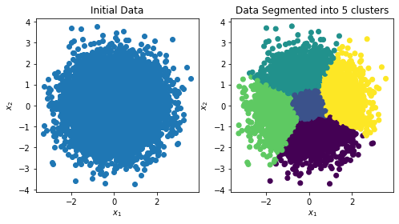
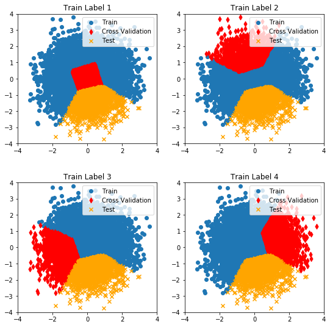

# *Kluster*-Fold Cross Validation (`KFCV`)

## About

### *K*-Fold Cross Validation
When training a machine learning model to make predictions on a feature space, a recurring question is how well the model will generalise to unseen data.
The most common model development strategies involve splitting the data set into `test` and `train` portions, with the training data further split into subtraining and cross validation sets.
The splitting of a training set into `train` and `test` potions, and further subdivision of the `train` data into folds is typically conducted through uniform random sampling.

Cross validation techniques such as *k*-fold cross validation divide the training data into *k* equally sized folds; train the model on *k-1* folds and then test the model with the held out fold.
This is repeated for all *k* folds allowing an average model evaluation can be determined from all fold validations.

### *Kluster*-Fold Cross Validation (`KFCV`)
While these techniques help understand the model's tendency to over or under fit the training data, the question still persists of how well the model will be able to generalise to novel training points.
Standard *k*-fold cross validation typically splits the data based on a uniform random sampling of data points, meaning that both the `train` and `test` data can contain similar data.
While the `train` and `test` data should contain similar points to enable full understanding of the *current* data set, this does not guarantee model performance outside of this initial data in the absence of further data.

`KFCV` is an extension of standard cross validation where instead of splitting the initial data randomly into `train` and `test` sets, they are instead split based on a unsupervised clustering method.
The use of a clustering method allows for data points in the initial data set to be grouped into similar clusters, one of which is then designated the `test` data set.
The remaining `train` data points are then re-clustered, using the same unsupervised clustering method as before, into *k* clusters.
Cross validation of the re-clustered training set then proceeds via a "one cluster held out" approach with training conducted on *k-1* folds and assessment on the remaining fold, *k* times.

The use of clustering to segregate a `test` data set based on similarity (and subsequently for cross validation) allows for the trained model to be assessed against data it was not originally trained on.
This helps simulate a situation where the model must make a prediction based on unseen data, giving insight into the model/data behaviour, and allowing the original data set to gain more mileage.

 
## Usage
An example of the `kfcv` class can be found in the [demo jupyter notebook](notebooks/kfcv_demonstration.ipynb).
A simple 2D feature space is used here to demonstrate the clustering suitably as higher dimensions become harder to visualise.

## TODO
* Set up Docker build on Travis
 